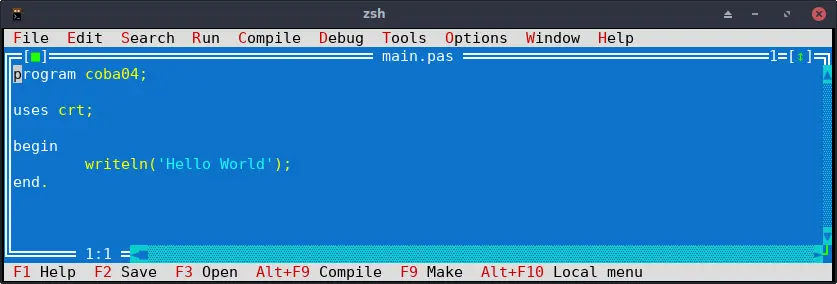

# Pascal

||
|:--:|
|FPC IDE|

## Intro 

Semua indah pada waktunya, rasanya ini berlaku pada semua hal tidak hanya pada disney mulan (animasi. memang ada versi yang lain? hehe). Disaat compiler lain masih susah untuk digunakan dan basic terlalu interpreter, pascal hadir untuk mengisi celah yang cukup dalam antara programmer C dan Basic.

Ada beberapa versi untuk compiler pascal namun yang paling populer adalah versi dari borland, dengan nama borland turbo pascal. Bahasa pemograman ini diajarkan diberbagai jurusan di universitas terutama tehnik elektronika dan komputer (circa 2004). Namun seiring waktu pengguna pascal makin berkurang salah satu alasannya menurut saya pribadi adalah karena GCC, yups GCC yang di bundle dengan distro linux dan diedarkan dengan bebas, mampu menarik perhatian siapapun juga (termasuk saya) dan ketidak hadiran pascal pada linux membuat para developer beralih ke C/C++. 

Faktor lain dari tenggelamnya pascal juga karena kurang tersedianya compiler opensource yang bisa digunakan. Borland seperti pemain tunggal dibagian ini. Yups ini seperti Borland Vs Universe hehe.

Namun para pecinta pascal tidak tinggal diam, mereka berkumpul dan membuat compiler pascal sendiri dibawah project opensource dengan nama Free Pascal atau disingkat FPC (Free pascal compiler), pascal mulai digunakan lagi di berbagai OS salah satunya Linux sampai sekarang.