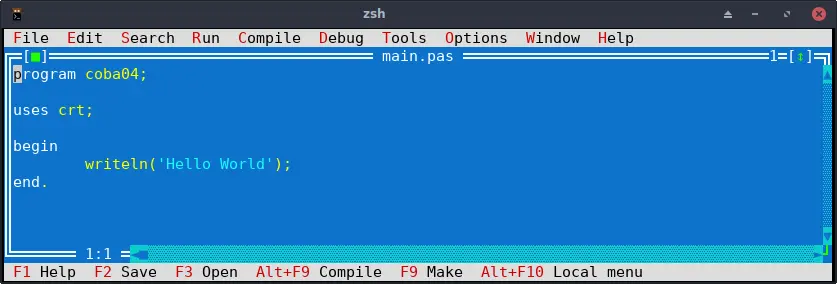

# Text Ide

Package FPC sudah dilengkapi dengan IDE sederhana dan entah mengapa dibuat sangat mirip dengan tampilan Borlan Turbo Pascal versi DOS. heheh.

## Cara menggunakan

Buka terminal dan ketik `fp`, jika tidak ada error akan muncul tampilan seperti dibawah ini 

||
|:--:|
|Tampilan FP IDE|

Jika pada tampilanmu tidak ada tulisan apa-apa itu wajar, gambar diatas saya ambil dari yang sudah ada di server, daripada bikin n upload lagi hehe.

