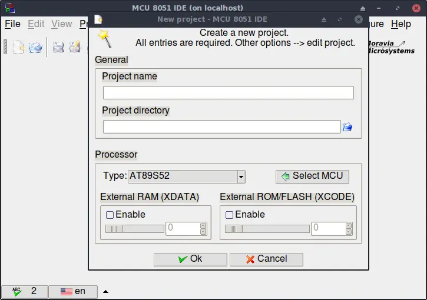
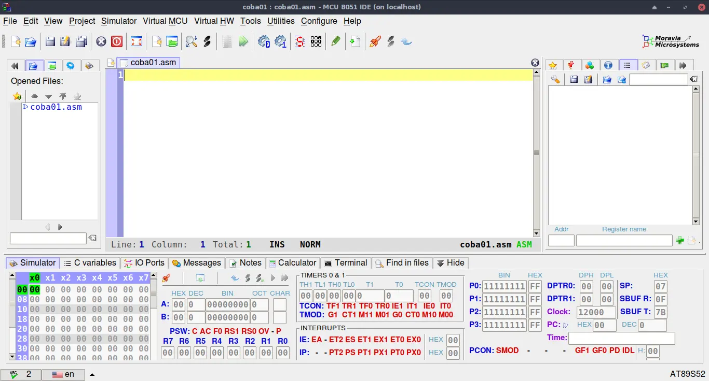




# Software

!!! note
Tanpa Software/Firmware pun AT89S52 masih sangat berguna, sebagai gantungan kunci hehe.

## Fungsi Software

Fungsi dari software ini adalah untuk menggerakkan berbagai peripheral yang tersedia didalam {{var.at89}} misalnya adalah Port Input Output (PIO), Timer, Serial Port, dll. 

Tidak seperti bagian hardware yang sangat miskin dibanding {{var.uc}} lainnya, {{var.at89}} memiliki dukungan yang melimpah di bagian ini. Mulai dari asembler, c compiler, pascal compiler, basic compiler sampai simulator bisa dicari dengan sangat mudah. untuk keperluan pembuatan software/firmware dari {{var.at89}} saya menggunakan {{var.ide}} yang bagi saya sudah lebih dari cukup untuk membuat firmware C atau assembly.

## {{var.ide}}

Tidak seperti software PC pada umumnya, software pada {{var.uc}} tidak bisa dijalankan(klik 2x) pada PC, hal ini dikarenakan cpu pada PC(x86 atau compatilbe) berbeda dengan cpu {{var.at89}}, sehingga untuk menjalankan software ini digunakan emulator, opsi lainnya adalah mencobanya langsung ke dev board, opsi terakhir ini kurang cocok untuk latihan pemograman {{var.at89}} selain harus beli board nya juga proses pemindahan data dari PC ke {{var.at89}} relative ribet hehe dan juga untuk belajar proses debugging adalah wajib dengan menggunakan board langsung prosess ini butuh alat-alat yang relative mahal.

{{var.ide}} memiliki berbagai fitur yang sangat menarik diantaranya

- Mendukung bahasa C dan assembly.
- Mendukung debugger.
- Mendukung berbagai macam komponen virtual seperti switch, LCD, dll.

### Cara Install

{{var.ide}} bisa digunakan di berbagai OS, diantaranya Linux, Windows, BSD, dll. Pada dokument ini hanya membahas cara install pada Linux dan windows.

#### Linux

Pada Artix linux untuk {{var.ide}} terdapat pada aur, cara termudah menginstallnya adalah dengan menggunakan yay

```bash
$ yay -S mcu8051ide
```

Setelah {{var.ide}} berhasil terinstall akan muncul shortcut di application menu. atau juga bisa dijalankan melalui shell dengan perintah

```bash
$ mcu8051ide
```

#### Windows

{{var.ide}} bisa didownload pada situs {{var.ideUrl}} cara install nya seperti biasa klik2x dan next, next, next, finish. hehe.

## Create New Project
| <a name="image1"></a> {: loading=lazy} |
|:--:|
| *Image: Tampilah msc8051ide di {{glob.artix}}* |

Jika gambar ["mcs51ide"](#image1) muncul saat applikasi dijalankan, lanjut ke langkah selanjutnya pada toolbar "Project" pilih "New"

| <a name="image2" ></a> {: loading=lazy}|
|:--:|
|*Image: New Project*|

isi dengan

* Project Name = `coba01` (jangan pakai spasi dan jangan terlalu panjang)
* Project Directory = `/home/<user>/mcs51/coba01`
* Type = `AT89S52`

tekan "OK", jika ada tawaran untuk membuat folder baru tekan saya "Yes"

Langkah pertama yang harus dilakukan adalah save file, tekan menu "File" pada toolbar dan pilih "Save As" maka akan muncul gambar seperti berikut

| <a name="image3" ></a> {: loading=lazy}|
|:--:|
|*Image: Save As*|

pada menu "Filter" terlihat jenis file yang disupport oleh {{var.ide}} yakni

* .asm == 8051 assembly
* .c == SDCC C source 
* .h == SDCC C Header

untuk saat ini kita akan mencoba menggunakan file assembly. pada gambar ["Save As"](#image3) isi "Location" dengan `coba01.asm` dan filter pilih `*` atau `.asm`.

Jika sesuai dengan urutan maka hasil nya seperti dibawah ini.

| <a name="image4" ></a> {: loading=lazy}|
|:--:|
|*Image: New Project Done.*|
