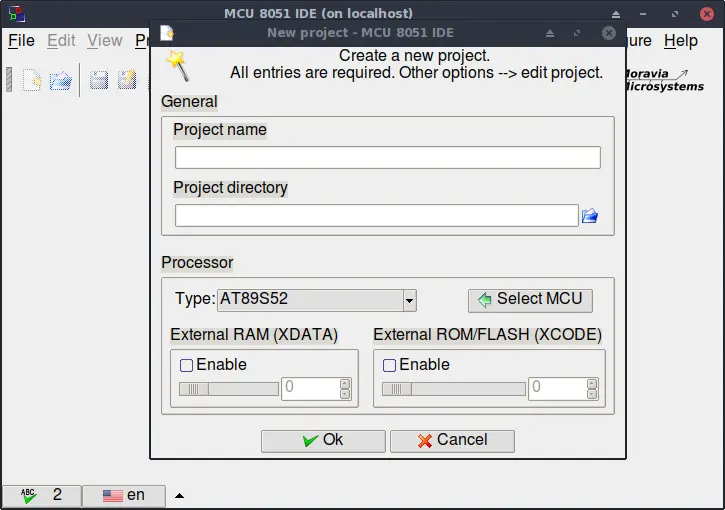
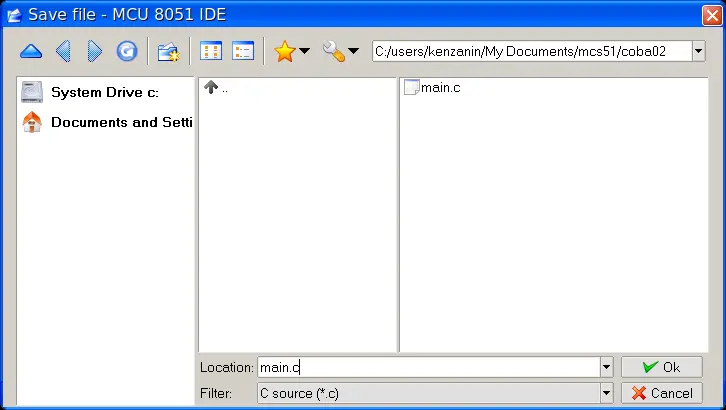
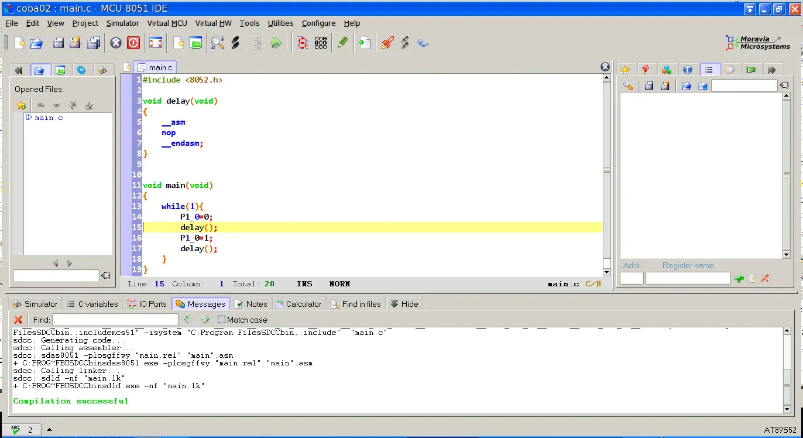



# Hello World C style

Sama seperti pada halaman ["Hello World Asm Style"](helloWorldAsm.md), pogram ini untuk menyalakan dan mematikan Pin pada {{var.at89}}. Hanya saja menggunakan C (SDCC).

## Pembuatan Project Baru
Hampir sama dengan step dari halaman "Software" pada bab ["Create New Project"](./software.md#create-new-project) , namun pada step "Save As" simpan dengan nama `main.c`, lihat perbedaan extension nya untuk assembly adalah `.asm` sedang untuk `C` adalah `.c`, berikut step nya.

Buat folder kosong dengan nama `coba02` pada toolbar "Project" pilih "New" 

| <a name="image2" ></a> {: loading=lazy}|
|:--:|
|*Image: New Project*|

isi dengan

* Project Name = `coba02` (jangan pakai spasi dan jangan terlalu panjang)
* Project Directory = `/home/<user>/mcs51/coba01` (jangan pakai spasi dan jangan terlalu panjang)
* Type = `AT89S52`

tekan "OK", jika ada tawaran untuk membuat folder baru tekan saya "Yes"

Langkah pertama yang harus dilakukan adalah save file, tekan menu "File" pada toolbar dan pilih "Save As" maka akan muncul gambar seperti berikut

| <a name="image3" ></a> {: loading=lazy}|
|:--:|
|*Image: Save As*|

pada menu "Filter" terlihat jenis file yang disupport oleh {{var.ide}} yakni

* .asm == 8051 assembly
* .c == SDCC C source 
* .h == SDCC C Header

untuk saat ini kita akan mencoba menggunakan file C. pada gambar ["Save As"](#image3) isi "Location" dengan `coba02.c` dan filter pilih `*` atau `.c`.

Jika sesuai dengan urutan maka hasil nya seperti dibawah ini.

| <a name="image4" ></a> {: loading=lazy}|
|:--:|
|*Image: New Project Done.*|

## The Code

```c
--8<-- "microController/mcs51/src/coba02.c"
```
Copas atau ketik ulang code diatas dan tekan F11 untuk compile, jika tidak ada pesan error pada panel message, maka bisa lanjut kemode debug dengan menekan tombol F5, jalankan pogram baris per baris dengan menekan tombol F6.

Untuk contoh-contoh yang lebih menarik bisa dilanjutkan di ["MCS51 C"](../lang/mcs51c/intro.md)

Goodluck